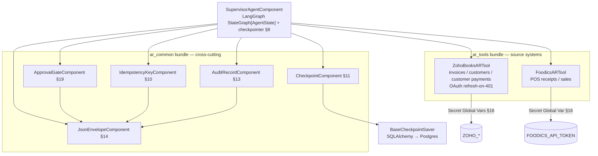
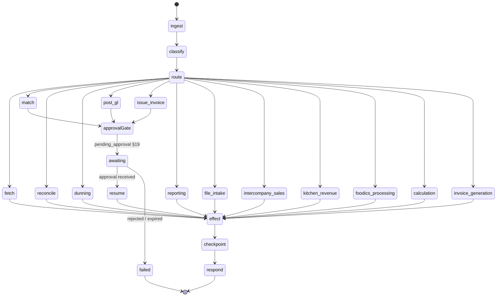
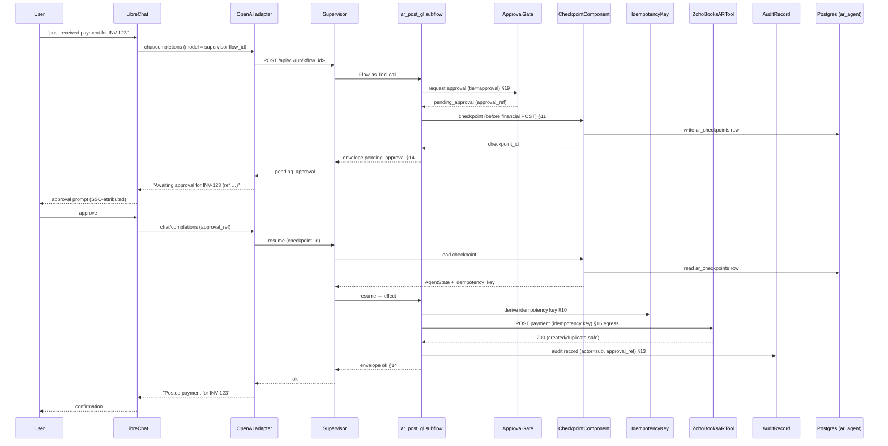
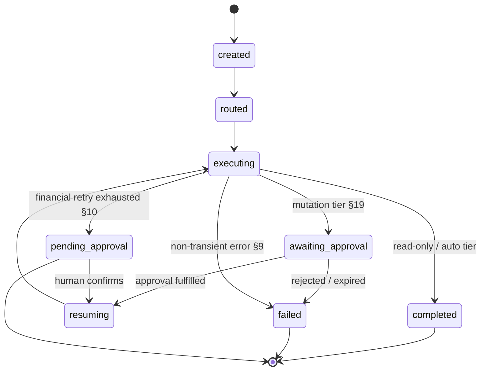
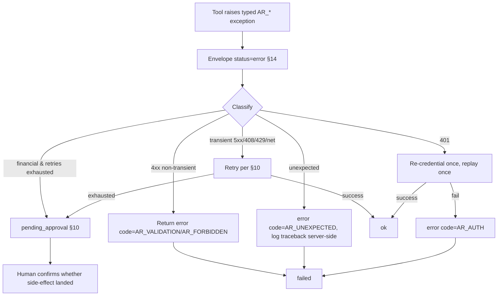
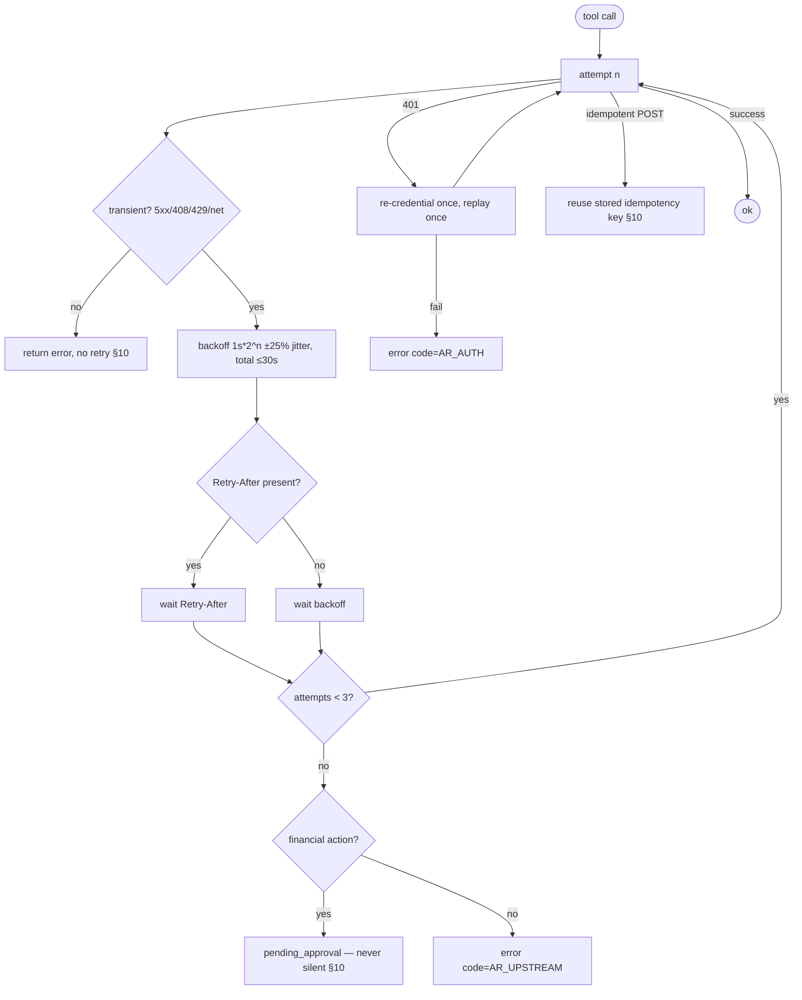
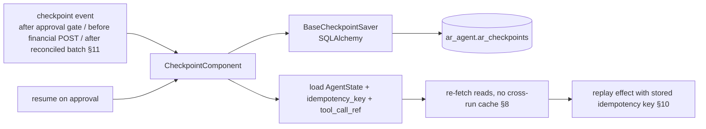
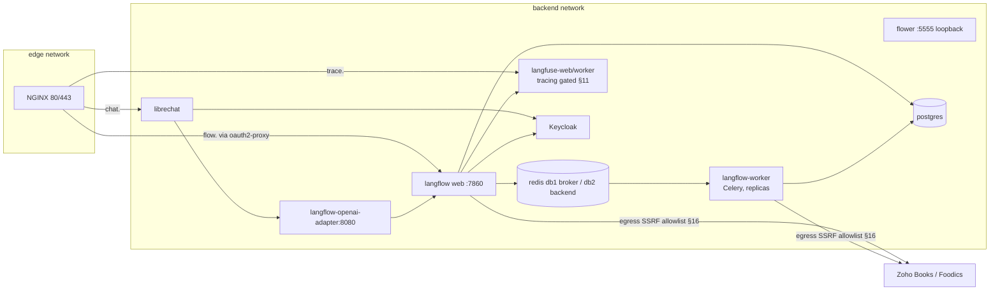
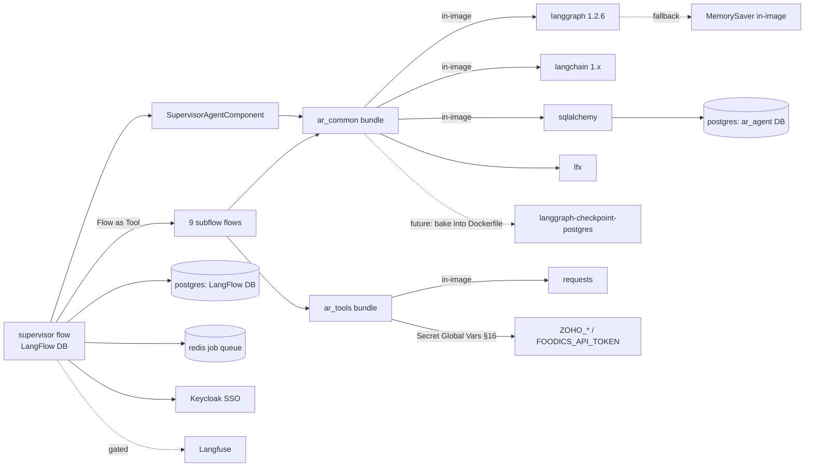

# Cosmic AR Agent — Architecture

The architecture that realizes the [Project Constitution](cosmic-ar-constitution.md).
One Supervisor Agent, fifteen reusable LangFlow subflows, shared `lfx` Components,
explicit LangGraph state, and the supporting retry / checkpoint / error-recovery
architectures. **This is a design document — no flows are implemented here.** The
folder structure and component names/signatures below make the later build phase
mechanical.

> **Diagram convention.** Every other doc in this repo uses ASCII diagrams. This
> one uses **Mermaid** because the constitution's consumer (the architect) asked
> for it. It is an intentional, single-doc deviation; do not propagate mermaid to
> the platform docs.

## 1. Overview

The Cosmic AR Agent is a single LangFlow flow whose core node is a custom
`SupervisorAgentComponent`. That component builds an explicit LangGraph
`StateGraph[AgentState]` (typed dataclass state, immutable updates) with a
Postgres-backed LangGraph checkpointer. The supervisor drives fifteen reusable
LangFlow subflows, exposed to it as LangChain tools via the built-in **Flow as
Tool** node (`FlowToolComponent`). Entry and human-approval happen through the
existing LibreChat → OpenAI-adapter → LangFlow path (`model` = supervisor flow
id), which is SSO-gated by Keycloak via `oauth2-proxy`. The platform view (NGINX,
SSO, datastores) is in [architecture](architecture.md); this doc covers the agent
layer only and cross-links the constitution section (§n) each element obeys.

## 2. High-Level Architecture

```mermaid
flowchart LR
  U([User / Approver]) --> LC[LibreChat<br/>chat.]
  LC --> ADP[OpenAI adapter<br/>model = supervisor flow_id]
  ADP -->|POST /api/v1/run/&lt;flow_id&gt;| LF[LangFlow web tier]
  LF --> SUP[SupervisorAgentComponent<br/>LangGraph StateGraph]
  SUP -->|Flow as Tool| F1[ar_fetch_invoices]
  SUP -->|Flow as Tool| F2[ar_fetch_receipts]
  SUP -->|Flow as Tool| F3[ar_match_payments]
  SUP -->|Flow as Tool| F4[ar_reconcile]
  SUP -->|Flow as Tool| F5[ar_dunning]
  SUP -->|Flow as Tool| F6[ar_post_gl]
  SUP -->|Flow as Tool| F7[ar_issue_invoice]
  SUP -->|Flow as Tool| F8[ar_reporting]
  SUP -->|Flow as Tool| F9[ar_approval]
  F1 & F2 & F3 & F4 & F6 & F7 & F8 --> SH[Shared components<br/>ar_common]
  SH --> TOOLS[ar_tools<br/>ZohoBooksARTool / FoodicsARTool]
  TOOLS -->|egress: SSRF allowlist §16| ZB[Zoho Books]
  TOOLS -->|egress: SSRF allowlist §16| FD[Foodics POS]
  SUP -->|checkpoint §11| PG[(Postgres<br/>ar_agent DB)]
  LF -->|flow store| PG
  SUP -.->|tracing (gated) §11 caveat| LFU[Langfuse]
  LF <--> RQ[(Redis<br/>job queue)]
  LF --> WK[langflow-worker<br/>Celery tier]
  KC[Keycloak / oauth2-proxy<br/>SSO §19] gates LC
  KC gates LF
```

- **Entry/approval surface:** LibreChat (`chat.<domain>`) → `langflow-openai-adapter`
  → LangFlow. The adapter maps the OpenAI `model` field to the supervisor flow id
  (`docker/langflow-adapter/adapter.py`); it runs one flow per request and does no
  routing, so all dispatch lives inside the supervisor flow.
- **Orchestration:** `SupervisorAgentComponent` (a custom `lfx` Component) holds the
  LangGraph `StateGraph[AgentState]` and a checkpointer; the fifteen subflows are its
  tools.
- **State & resume:** checkpoints in a dedicated `ar_agent` Postgres DB — the source
  of truth for resume because Langfuse tracing is currently off (§11 caveat, see
  [FAQ](faq.md)).
- **Background work:** long-running subflows may be promoted to the Celery worker
  tier over the Redis job queue; see [Scaling](scaling.md).

## 3. Component Diagram

The shared `lfx` Components (reused across the fifteen subflows) and the source-system
tools. Each is labelled with the constitution section it implements. The
`cosmic_common` readers (Excel/CSV/PDF), document classifier, and validation
engine are implemented (ADR-0004); the remaining `cosmic_common` components are
scaffold, implemented per-subflow at build phase.



- `SupervisorAgentComponent` — owns the `StateGraph[AgentState]` (§8), the
  checkpointer, and the routing of tool calls; the only stateful node.
- `ar_common` — the six cross-cutting components (envelope, approval, idempotency,
  checkpoint, audit) reused by every subflow; stateless tool components per §8.
- `ar_tools` — the two source-system read/write tools, mirroring the existing
  `ap_tools` bundle's credential pattern (`SecretStrInput(..., load_from_db=True)`).
- Reuse note (§15): the existing `ap_tools` bundle (`ZohoBooksAPTool`,
  `FoodicsAPTool`) is **not** AR-reused — its operations are AP-oriented — but it is
  the template for `ar_tools`, and the seed for the future AP extension (§20).

## 4. Fifteen reusable LangFlow subflows

Each subflow is a LangFlow flow (definition stored in the LangFlow Postgres DB, not
on disk — §7), exposed to the supervisor via **Flow as Tool**. IDs follow `ar_<verb>
_<object>` (§6); tiers follow §19.

| # | Flow id | Purpose | Tier (§19) | Shared components | Source tool |
|---|---------|---------|-----------|-------------------|-------------|
| 1 | `ar_fetch_invoices` | List/read outstanding AR invoices | read-only | Envelope | ZohoBooksARTool |
| 2 | `ar_fetch_receipts` | List/read Foodics POS receipts | read-only | Envelope | FoodicsARTool |
| 3 | `ar_match_payments` | Match receipts → invoices (threshold-gated) | auto / approval | Envelope, Idempotency | ZohoBooksARTool, FoodicsARTool |
| 4 | `ar_reconcile` | Reconcile matched set, compute balances | auto | Envelope | ZohoBooksARTool |
| 5 | `ar_dunning` | Send routine overdue reminders | auto | Envelope, Audit | ZohoBooksARTool |
| 6 | `ar_post_gl` | Post received payment to the GL | approval | Envelope, ApprovalGate, Idempotency, Checkpoint, Audit | ZohoBooksARTool |
| 7 | `ar_issue_invoice` | Issue/present a new AR invoice | approval | Envelope, ApprovalGate, Idempotency, Checkpoint, Audit | ZohoBooksARTool |
| 8 | `ar_reporting` | AR aging / dashboard extract | read-only | Envelope | ZohoBooksARTool, FoodicsARTool |
| 9 | `ar_approval` | Capture/fulfill human approval (pending → approved/rejected); reused by 3/6/7 | approval / dual-control | ApprovalGate, Checkpoint, Audit | — |
| 10 | `ar_file_intake` | Parse an uploaded Excel/CSV/PDF into a `DocumentManifest` (classify, extract metadata, validate) | read-only | Envelope, Validation, Checkpoint, Audit | File node (upload) |
| 11 | `ar_intercompany_sales` | Read a KOT (Kitchen Order Ticket) Excel from intercompany buyer restaurants, validate rows, calculate revenue at the agreed rate, generate draft `InvoiceData` per buyer + Validation/Exception reports | approval (v1 draft-only) | Envelope, Validation, Checkpoint, Audit | File node (KOT upload) |
| 12 | `ar_kitchen_revenue` | Read the four Cosmic Kitchen sheets (Menu Sales Analysis, Daily Sales, Detailed Check Payment, Marriott Backup); compute Revenue (Breakfast/Half Board segments), Collections, Expenses, Net Receivable, Net Payable; generate Revenue JSON + Validation/Exception reports | read-only | Envelope, Validation, Checkpoint, Audit | File node (4-sheet upload) |
| 13 | `ar_foodics_processing` | Read Foodics Order + Order Items + Order Payments (export files or Foodics API); build a consolidated dataset + pivot + payment-type breakdown; apply discount rules; generate a Zoho Books upload format + draft `InvoiceData` per order + Validation/Exception reports | approval (v1 draft-only) | Envelope, Validation, Checkpoint, Audit | File node (3-sheet upload) / Foodics API |
| 14 | `ar_calculation` | Read validated JSON (P10 Validation Flow output — aggregated facts + parameters); compute Revenue/Discount/VAT/Municipality Tax/Royalty/Collections/Expenses/Net Receivable/Net Payable via the Business Rule Engine (zero hardcoded formulas); emit a `CalculationResult` + Validation/Exception reports | read-only | Envelope, Validation, Checkpoint, Audit | Validated JSON input (P10 Validation Flow output) |
| 15 | `ar_invoice_generation` | Read a validated-JSON invoice request (customer_ref, line_items, totals, issue_date, currency); assemble a draft `InvoiceData`; generate Invoice JSON / PDF render-spec / Excel render-spec / draft Journal Entry / Customer Statement / Zoho Upload File / Invoice Metadata + WorkflowState as JSON-in-envelope; no posting | read-only | Envelope, Validation, Checkpoint, Audit | Validated JSON invoice request |

> Row 10 (`ar_file_intake`) is added by [ADR-0004](../cosmic-ar/docs/adr/adr-0004-file-intake-flow.md),
> amending this section's original "Nine reusable subflows" to "Ten". Row 11
> (`ar_intercompany_sales`) is added by [ADR-0005](../cosmic-ar/docs/adr/adr-0005-intercompany-sales-flow.md),
> further amending it to "Eleven". Row 12 (`ar_kitchen_revenue`) is added by
> [ADR-0006](../cosmic-ar/docs/adr/adr-0006-kitchen-revenue-flow.md), further
> amending it to "Twelve". Row 13 (`ar_foodics_processing`) is added by
> [ADR-0007](../cosmic-ar/docs/adr/adr-0007-foodics-processing-flow.md), further
> amending it to "Thirteen". Row 14 (`ar_calculation`) is added by
> [ADR-0008](../cosmic-ar/docs/adr/adr-0008-calculation-flow.md), further
> amending it to "Fourteen" and recording a §55 waiver (VAT/Municipality Tax/
> Royalty are computed as invoice/reconciliation figures, not a statutory
> filing). Row 15 (`ar_invoice_generation`) is added by
> [ADR-0009](../cosmic-ar/docs/adr/adr-0009-invoice-generation-flow.md), further
> amending it to "Fifteen". `ar_file_intake` is the only subflow that
> parses user-uploaded files; its manifest is returned in the §14 envelope
> `data.manifest` (not added to `AgentState`). The supervisor routes a file-only
> upload (no intent keyword) to it at 0.4 (below `MIN_CONFIDENCE` →
> `AR_UNCERTAIN` unless the user adds an "intake/upload" keyword — §4).

> Row 11 (`ar_intercompany_sales`) is **compute + draft only in v1**: its tier is
> `approval` (the intent is invoice production), but the §19 gate is dormant — it
> emits a draft `InvoiceData[]` per buyer in `data.invoices` and returns `AR_OK`,
> with no posting, no idempotency key, and no `pending_approval`. Revenue is not a
> recognized `data.totals` key, so it is not added to `AgentState` (ADR-0005 §7);
> the supervisor surfaces this flow only via `subflows_invoked` + `audit_refs`.

> Row 12 (`ar_kitchen_revenue`) is **read-only compute + report in v1**: it
> reads the four Cosmic Kitchen sheets, computes Revenue (Breakfast/Half Board
> segments), Collections, Expenses, Net Receivable, Net Payable, and returns
> `AR_OK` with a Revenue JSON + Validation/Exception reports — no posting, no
> idempotency key, no `pending_approval`, not in `FINANCIAL_INTENTS`. Revenue /
> collections / nets are not recognized `data.totals` keys, so they stay in the
> envelope `data` (no `AgentState` schema change — ADR-0006 §7). It records a
> checkpoint **after every calculation** (a stricter pattern than the
> single-end-checkpoint in rows 10/11 — ADR-0006 §9).

> Row 13 (`ar_foodics_processing`) is **compute + draft only in v1**: it reads
> Foodics Order + Order Items + Order Payments (export files now, Foodics API via
> a build-phase seam), builds a consolidated dataset + pivot + payment-type
> breakdown, applies discount rules, and emits a Zoho Books upload format + a
> draft `InvoiceData` per order + Validation/Exception reports — no posting, no
> idempotency key, no `pending_approval`, not in `FINANCIAL_INTENTS` (mirrors row
> 11, ADR-0007 §2). Its outputs are not recognized `data.totals` keys, so they
> stay in the envelope `data` (no `AgentState` schema change — ADR-0007 §8). It
> records a checkpoint **after every calculation**, continuing row 12's stricter
> pattern (ADR-0007 §10).

> Row 14 (`ar_calculation`) is **read-only compute + report in v1**: it reads a
> validated-JSON payload (aggregated facts + parameters — the planned P10
> Validation Flow output) and computes the nine Revenue/Discount/VAT/
> Municipality Tax/Royalty/Collections/Expenses/Net Receivable/Net Payable
> figures via the `BusinessRuleEngineComponent` — **zero hardcoded formulas in
> the flow** (the rules are declarative, overridable data). It returns `AR_OK`
> with a `reconcile`-type `CalculationResult` + Validation/Exception reports —
> no posting, no idempotency key, no `pending_approval`, not in
> `FINANCIAL_INTENTS` (mirrors row 12, ADR-0008 §3). The nine figures are not
> recognized `data.totals` keys, so they stay in the envelope `data` (no
> `AgentState` schema change — ADR-0008 §10). It records a checkpoint **after
> every calculation**, continuing rows 12/13's stricter pattern (ADR-0008 §12).
> It is the first subflow with **no `files` input** (facts arrive as JSON —
> ADR-0008 §11) and records a §55 waiver (VAT/Municipality Tax/Royalty as
> figures, not statutory filing — ADR-0008 §2).

> Row 15 (`ar_invoice_generation`) is **read-only generate + draft in v1**: it
> reads a validated-JSON invoice request (customer_ref, line_items, totals,
> issue_date, currency), assembles a draft `InvoiceData`, and generates eight
> artifacts — Invoice JSON, Invoice PDF render-spec, Invoice Excel render-spec,
> draft Journal Entry, Customer Statement, Zoho Upload File, Invoice Metadata,
> plus WorkflowState — as JSON-in-envelope, returning `AR_OK` — no posting, no
> idempotency key, no `pending_approval`, not in `FINANCIAL_INTENTS` (mirrors
> row 14, ADR-0009 §2). The PDF/Excel artifacts are **render-ready JSON specs in
> v1** (binary materialization is build-phase — ADR-0009 §5); the Journal Entry
> is a balanced draft (`status="draft"`, no POST — §1). Its artifacts are not
> recognized `data.totals` keys, so they stay in the envelope `data` (no
> `AgentState` schema change — ADR-0009 §4). It records a checkpoint **after
> every generation step** (8 labels), continuing rows 12/13/14's stricter
> pattern (ADR-0009 §11). It is the second subflow with **no `files` input**
> (the invoice request arrives as JSON — ADR-0009 §4). It is distinct from row 7
> `ar_issue_invoice`, which **posts** the invoice to Zoho at tier `approval`;
> this flow only **generates draft artifacts for review**. Its `INTENT_KEYWORDS`
> are placed before `ar_fetch_invoices` so "generate invoice" / "draft invoice"
> / "invoice pdf" etc. are not shadowed by `ar_fetch_invoices`' bare "invoice"
> keyword (ADR-0009 §3).

> `ar_approval` is the shared human-in-the-loop gate (§19). Any subflow whose tier
> is `approval` or `dual-control` routes through it; it writes the checkpoint and
> returns `pending_approval` in the envelope (§14) until fulfilled.

## 5. Flow Diagram (LangGraph StateGraph)

The supervisor's internal graph. Mutation nodes route through the approval gate
before any effect (§19).



- `ingest` binds `trace_id`, `tenant`, `intent` into `AgentState` (§8).
- `classify`/`route` choose a subflow tool (LLM judgement where rules are fuzzy;
  deterministic where fixed — §4 design principle 3).
- `approvalGate` is the pause/resume state: it checkpoints (§11) and emits
  `pending_approval`; the run resumes from the checkpoint on approval.

## 6. Sequence Diagram

A representative GL-post run showing the §11 checkpoint-before-financial-POST
boundary and the §19 approval round-trip.



## 7. State Lifecycle



`AgentState` (typed dataclass, §8). Nodes return **fragments** (immutable updates);
financial totals are explicit named fields; tool components are stateless.

| Field | Type | § | Purpose |
|-------|------|---|---------|
| `trace_id` | str | §12 | Correlates logs/audit across the run |
| `flow_id` | str | §12 | Supervisor flow UUID |
| `tenant` | str | §12 | Cosmic Vikings entity scope |
| `intent` | str | — | Classified user intent → routed subflow |
| `matched_amount` | Decimal | §8 | Running total of matched receipts |
| `outstanding_balance` | Decimal | §8 | Running outstanding AR balance |
| `posted_total` | Decimal | §8 | Running total of posted payments |
| `pending_approvals` | list[Approval] | §8/§19 | `{approval_id, action, amount, requested_by, requested_at}` |
| `idempotency_keys` | dict[str,str] | §10 | action → key; replayed on retry/resume |
| `tool_call_ref` | str | §11 | `trace_id + tool + index`, enough to re-fetch |
| `audit_refs` | list[str] | §13 | Links to audit records written |

> **Resume determinism (§8):** a loaded checkpoint plus the same external state
> reproduces the same decision. Reads are re-fetched on resume — never cached across
> runs.

## 8. Execution Sequence

The prose companion to the sequence diagram, with the standard applied at each step:

1. **Ingest** — adapter selects supervisor flow by `model`; `ingest` binds
   `trace_id`, `tenant`, `intent` into `AgentState` (§8).
2. **Classify & route** — supervisor picks a subflow tool; envelope contract begins
   (§14).
3. **Subflow (Flow-as-Tool)** — the selected subflow runs in-process; shared
   `ar_common` components wrap its I/O.
4. **Approval gate (if mutation)** — tier ≥ `approval` (§19); `ApprovalGateComponent`
   returns `pending_approval`; `CheckpointComponent` writes a checkpoint **before**
   the financial POST (§11).
5. **Resume on approval** — load checkpoint, re-fetch reads (§8), derive the stored
   idempotency key (§10).
6. **Effect** — source-system tool call via SSRF-allowlisted egress (§16), wrapped in
   the retry/backoff loop (§10).
7. **Audit** — `AuditRecordComponent` writes the immutable record with `actor`
   (Keycloak `sub`) and `approval_ref` (§13).
8. **Respond** — canonical envelope returned through the adapter to LibreChat (§14).

## 9. Error Recovery

A single error node classifies every tool exception and maps it to the envelope
(§14). Component output methods never raise (§5); they catch at the boundary.



| Error class (§9) | Handling |
|------------------|----------|
| `CredentialError` | `error` `AR_CREDENTIAL_MISSING`; no retry |
| `ValidationError` | `error` `AR_VALIDATION`; no retry |
| HTTP 401 | one re-credential + one replay, else `AR_AUTH` |
| HTTP 403 | `error` `AR_FORBIDDEN`; alert; no retry |
| HTTP 404 | `error` `AR_NOT_FOUND`; not retried |
| HTTP 408 / 429 | retry per §10; honor `Retry-After` |
| HTTP 5xx / net | retry per §10 |
| unexpected | `error` `AR_UNEXPECTED`; traceback server-side only |

## 10. Retry Architecture

Owned by `IdempotencyKeyComponent` plus a backoff loop around every tool call.



- **No retry on 4xx** except 408/429 (§10).
- **Idempotency keys mandatory** for any financial POST; retries replay the same key
  so the upstream deduplicates.
- **Exhausted financial retry → `pending_approval`**, never a silent failure — a human
  confirms whether the side effect landed (§10).

## 11. Checkpoint Architecture

`CheckpointComponent` wraps a thin custom `BaseCheckpointSaver` over SQLAlchemy,
writing to a dedicated `ar_agent` Postgres DB. This is the **source of truth for
resume** because Langfuse tracing is disabled (`LANGFLOW_DEACTIVATE_TRACING=true`,
§11 caveat; see [FAQ](faq.md)).



`ar_checkpoints` record (least-privilege role, provisioned later by extending
`docker/postgres/init/01-databases.sh`):

| Field | Type | Purpose |
|-------|------|---------|
| `checkpoint_id` | uuid PK | Resume handle |
| `trace_id` | str | Correlates to logs/audit (§12/§13) |
| `agent_state` | jsonb | Full `AgentState` snapshot (§8); **never the raw secret** |
| `intended_next_action` | str | What to do on resume |
| `idempotency_key` | str | Replayed on the financial POST (§10) |
| `tool_call_ref` | str | `trace_id + tool + index` to re-fetch |
| `created_at` | timestamptz | When |
| `status` | str | `awaiting_approval` / `resumed` / `completed` |

> **Fallback:** if the Postgres saver is unavailable at boot, the supervisor falls
> back to LangGraph's in-process `MemorySaver` (in-image). That is non-durable
> (lost on recreate) and is treated as a degraded mode, not production. Preferred
> future simplification: bake `langgraph-checkpoint-postgres` into
> `docker/langflow/Dockerfile`.

## 12. Deployment Architecture



- Only NGINX publishes host ports (80/443); Flower is loopback-only
  (`127.0.0.1:5555`). All agent containers are `backend`-only.
- The supervisor flow runs on the `langflow` web tier; long-running subflows can be
  promoted to background runs on `langflow-worker` over the Redis job queue
  (`LANGFLOW_JOB_QUEUE_TYPE=redis`) — see [Scaling](scaling.md).
- SSO gate on `chat.`/`flow.` via `oauth2-proxy` + Keycloak — the approver's Keycloak
  `sub` is the audit `actor` (§13/§19); see [OIDC](oidc.md).
- Egress to Zoho Books / Foodics is constrained by `LANGFLOW_SSRF_ALLOWED_HOSTS`
  (§16); see [Security](security.md). Backups incl. the new `ar_agent` DB follow
  [Backup](backup.md).

## 13. Technology Stack

| Component | Version | Role | § |
|-----------|---------|------|---|
| LangFlow (web + Celery) | 1.10.1 | Flow host, supervisor flow, subflows | §7 |
| `lfx` custom Components | (bundled) | Shared + source-system components | §5/§15 |
| LangGraph | 1.2.6 | `StateGraph[AgentState]`, checkpointer | §8/§11 |
| LangChain tools | 1.x | `Flow as Tool` → `BaseTool` for subflows | §15 |
| Postgres | 16 | Flow store + `ar_agent` checkpoints | §11 |
| Redis | 7 | Job queue (db1 broker / db2 backend) | §18 |
| LibreChat + OpenAI adapter | — | Entry + approval surface | §19 |
| Keycloak / oauth2-proxy | — | SSO gate; `actor` of record | §16/§19 |
| Langfuse | v3 | Intended trace/audit store (currently gated) | §11/§13 |
| Zoho Books, Foodics | — | AR source systems | §2 |

## 14. Dependency Graph



- **In-image** (no install): `langgraph`, `langchain`, `lfx`, `sqlalchemy`,
  `requests`, `MemorySaver`. Inline bundles rely on packages already in the image
  venv (the `ap_tools` `pyproject.toml` declares `dependencies = []`).
- **Needs baking into `docker/langflow/Dockerfile`** (future): the
  `langgraph-checkpoint-postgres` package, to replace the custom SQLAlchemy saver
  with the upstream Postgres saver.
- **Secret Global Variables** (managed in LangFlow UI, not `.env` — §16/§18):
  `ZOHO_CLIENT_ID`, `ZOHO_CLIENT_SECRET`, `ZOHO_REFRESH_TOKEN`, `ZOHO_ORG_ID`,
  `FOODICS_API_TOKEN`.
- **Platform deps:** Postgres, Redis, Keycloak, Langfuse — already provisioned.

## 15. Folder Structure (design)

Two new inline bundles under `docker/langflow-extensions/`, parallel to the existing
`ap_tools` bundle. Directory names are lowercase `snake_case` (enforced — §6).

```text
docker/langflow-extensions/
  ar_common/                  # cross-cutting shared components (§15)
    extension.json            # id: ar-common; bundle: ar_common
    pyproject.toml            # entry-point langflow.extensions -> components.ar_common
    README.md
    components/ar_common/
      __init__.py
      supervisor.py           # SupervisorAgentComponent (LangGraph StateGraph[AgentState]) §8
      envelope.py            # JsonEnvelopeComponent §14
      approval_gate.py        # ApprovalGateComponent §19
      idempotency.py          # IdempotencyKeyComponent §10
      checkpoint.py           # CheckpointComponent + BaseCheckpointSaver (SQLAlchemy) §11
      audit.py                # AuditRecordComponent §13
  ar_tools/                   # AR source-system tools (§20 seed shape)
    extension.json            # id: ar-tools; bundle: ar_tools
    pyproject.toml
    README.md
    components/ar_tools/
      __init__.py
      zoho_books_ar.py        # ZohoBooksARTool (invoices, customers, customer payments)
      foodics_ar.py           # FoodicsARTool (POS receipts/sales)
```

- The nine flow **definitions** live in the LangFlow Postgres DB
  (`LANGFLOW_DB_NAME`), not on disk (§7).
- The new `ar_agent` DB + least-privilege role + `ar_checkpoints` table is
  provisioned by extending `docker/postgres/init/01-databases.sh` (mirrors the
  existing per-service DB pattern) — a **build-phase** change, not part of this
  design doc.
- Bundles are validated offline (§15): `docker exec langflow python -m lfx extension
  validate /app/extensions/ar_common` (and `ar_tools`); edits apply on container
  recreate (the mount is `:ro`).